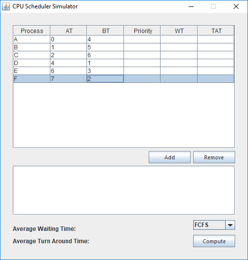
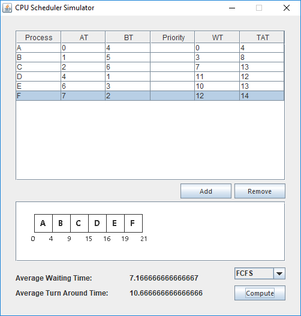
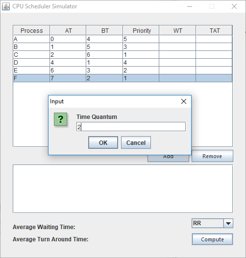
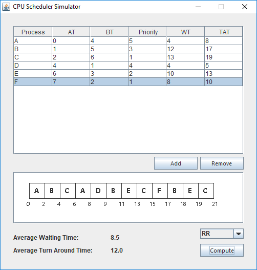

# CPUScheduler

Java implementation of 6 CPU scheduling algorithms: *First Come First Serve (FCFS)*, *Shortest Job First (SJF)*, *Shortest Remaining Time (SRT)*, *Priority Non-preemptive (PSN)*, *Priority Preemptive (PSP)*, and *Round Robin (RR)*.

## Usage

Instantiate a `CPUScheduler` object of the algorithm

```java
CPUScheduler fcfs = new FirstComeFirstServe();
```

Add a new `Row` for every job queued

```java
fcfs.add(new Row("P1", 0, 5));
fcfs.add(new Row("P2", 2, 4));
fcfs.add(new Row("P3", 4, 3));
fcfs.add(new Row("P4", 6, 6));
```

Call the `process` method

```java
fcfs.process();
```

Use the accessors

```java
fcfs.getAverageWaitingTime();     // 3.5
fcfs.getAverageTurnAroundTime();  // 8.0
```

### Round Robin

In the case of `RoundRobin`, you must first set a time quantum before calling `process`.

```java
CPUScheduler rr = new RoundRobin();

rr.add(new Row("P1", 0, 5));
rr.add(new Row("P2", 2, 4));
rr.add(new Row("P3", 4, 3));
rr.add(new Row("P4", 6, 6));

rr.setTimeQuantum(2);
rr.process();
```

### Rows

Using the object's `getRows` method will return a `List` of all queued `Row`. After `process`, each `Row` will reflect their respective computed *waiting time* and *turnaround time*.

```java
CPUScheduler sjf = new ShortestJobFirst();
List<Row> rows;

sjf.add(new Row("P1", 0, 5));
sjf.add(new Row("P2", 2, 4));

rows = sjf.getRows();
rows.get(1).getWaitingTime();     // 0
rows.get(1).getTurnaroundTime();  // 0

sjf.process();

rows = sjf.getRows();
rows.get(1).getWaitingTime();     // 3
rows.get(1).getTurnaroundTime();  // 7
```

### Timeline

Using the object's `getTimeline` method will return a `List` of `Event` which can be used to draw a Gantt chart. The timeline shows what job is being processed at the given time.

```java
List<Event> timeline = fcfs.getTimeline();

for (Event event : timeline)
{
  System.out.println(event.getStartTime());
  System.out.println("|  " + event.getProcessName());
}

System.out.print(timeline.get(timeline.size() - 1).getFinishTime());
```

Result:

```
0
|  P1
5
|  P2
9
|  P3
12
|  P4
18
```

## Example

An example can be found [here](src/Main.java).

## Demo

A Java Swing application using the library is [included](src/GUI.java) within the project.

### Screenshots

 
 
